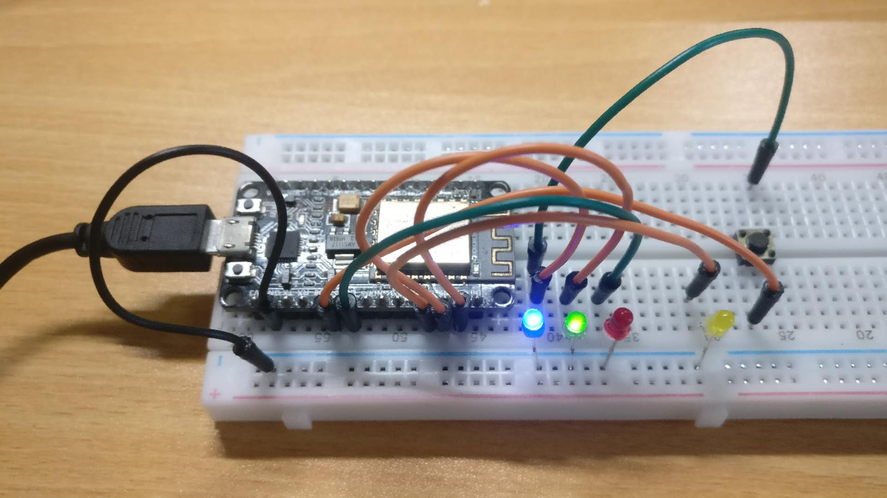

# LED_Weather



用LED简单显示天气信息，红色表示需要带伞， 绿色表示无需带伞，同时亮起表示请求失败。

A NodeMCU project which shows weather report with different led light.

## 文件列表 / Files List

- init.lua
- weather.lua
- wifi_controller.lua

## 脚定义 / Pins Definition

|Pin|类型|备注|
|:-:|:-:|:-|
|2|WiFi状态|常亮即WiFi已经连接|
|1|天气状态(阴晴无雨)|常亮即晴或多云或阴|
|6|天气状态(非阴晴)|常亮即雨或其他极端天气（需要带伞或不宜出门）|
|3|更新状态|常亮即正在获取新天气数据|
|7|更新按钮|按下以获取最新天气数据|

|Pin|Type|Remark|
|:-:|:-:|:-|
|2|WiFi status|Always on shows that WiFi is connected|
|1|Weather status (Green)|Always on shows that you do not need to take an umbrella|
|6|Weather status (Red)|Always on shows that you need to take an umbrella|
|3|Query status|Always on shows that system is querying the weather infomation|
|7|Query button|Click to renew the weather infomation|

## 依赖 / Dependancies

- gpio
- http
- pwm
- sjson
- wifi
- **API：知心天气 / seniverse.com**

## 安装 / Install

- 修改`init.lua`中的配置，填入WiFi信息、地理位置拼音与知心天气的SK (Modify the configurations)

```lua
-- configurations
wifi_ssid = "WIFI_SSID"
wifi_pwd = "WIFI_PASSWORD"

location = "yourCity"

-- 知心天气
weather_sk = ""
```

- 刷入上述文件列表中的所有文件 (Flash all the files mentioned above at files list)
- RESET或拔插电源以重启 (Press the reset button or replug to reboot MCU)
- 稍等片刻WiFi灯亮起 (WiFi status LED will be on)
- 按下按钮进行测试（Query Status亮起，天气状态灯熄灭 / After pressing the button to test, Query Status LED will be on, Weather Status LED will be off）

## 其他信息 / Other Things

灯光亮度使用PWM调光，可自行根据需要调节亮度。
